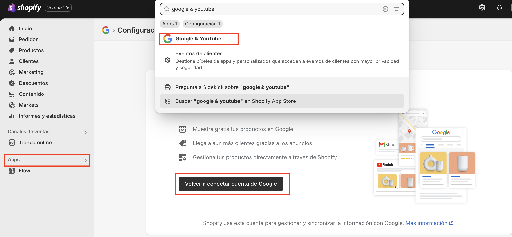

# ¿Cómo trackear eventos de ecommerce en Shopify con Google Analytics 4 (GA4)? - OPCION 1

## 1) Conexión directa con GA4

A través de la app oficial de Shopify llamada Google & YouTube (desarrollada por Google), puedes Conectar tu tienda con Google Analytics 4 (con una cuenta de google)
y enviar eventos básicos como:

- view_item
- add_to_cart
- begin_checkout
- purchase

*Al realizar la conexión te pide identificarte con una cuenta de google.   
*Al principio hay una serie de pasos que debes cumplir como (tener un métdo de pago activo, política de reembolsos, información de contacto, etc), pero hay una opción al lado derecho para solo configurar GA4.  
*La conexión requiere que te conectes a una cuenta de Google Merchant Center (en caso no tengas, te permite crearla desde allí) 
*Shopify te mostrará las cuentas de GA4 disponibles en la cuenta de google para conectar la tienda, lo más recomendable es crear una cuenta desde cero en GA4

### ¿Qué datos se envían?
Aunque la app Google & YouTube es sencilla, envía información detallada del producto a GA4 en eventos como add_to_cart, view_item o purchase. Por ejemplo, en un add_to_cart se pueden incluir:

- item_id
- item_name
- price
- quantity
- currency
- item_category (si asignaste tipo de producto)
- item_variant (si el producto tiene tallas o colores)
- item_brand (si lo completaste en los datos del producto)

Esto significa que puedes analizar en GA4 qué productos fueron vistos, agregados al carrito o comprados, con bastante nivel de detalle, **incluso sin usar Google Tag Manager ni tocar código.**

### Limitaciones de esta opción a pesar de su facilidad, esta integración tiene algunas restricciones importantes:

- No puedes ver ni editar el código de los eventos enviados
- No tienes acceso al dataLayer, lo que limita la personalización
- No puedes agregar eventos personalizados (como clics en botones, scroll, formularios, etc.)
- No puedes enviar datos a otras plataformas como Meta Ads, TikTok o Google Ads directamente

### ¿Cuándo usar esta opción?
Úsala si quieres una integración rápida y sin complicaciones con GA4
Pero si necesitas análisis más avanzados, remarketing, conversiones multicanal, o usar múltiples píxeles, entonces es mejor configurar Google Tag Manager con un dataLayer personalizado.

### 🚨Importante
Al ctivar esta opción se crea en automático el datalayer del producto, es decir, si quiere usar otra propiedad de GA4 con google tag manager vas a necesitar que shopify envie los datos de producto en el datalayer, sin embargo, shopify no lo hace por defecto, pero al activar esta app, se crea el datalayer con los eventos principales de ecommerce para poder probarlo en Google Tag Manager.

