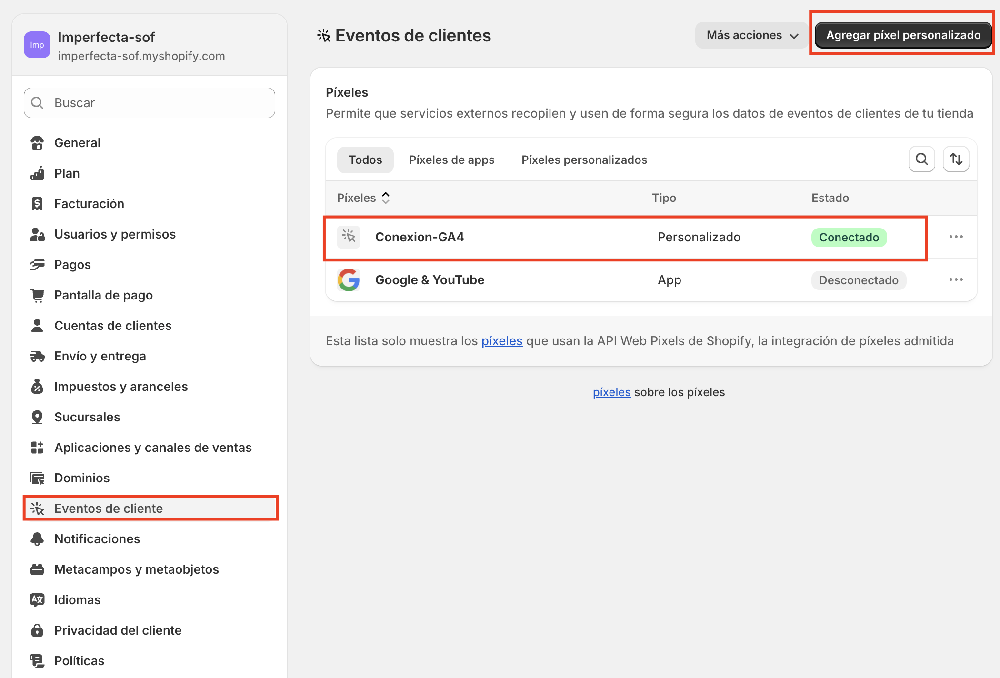

# ¿Cómo trackear eventos de ecommerce en Shopify con Google Analytics 4 (GA4)? - OPCION 2

## 2) Conexión a GA4 con código personalizado (sin GTM)

Si bien la conexión directa con GA4 es suficiente para muchas tiendas, existe una alternativa más flexible y potente: crear un píxel personalizado desde el editor de eventos de Shopify para capturar eventos de ecommerce usando la API de cliente analytics.subscribe().
Esta técnica permite enviar eventos directamente a Google Analytics 4 utilizando gtag(), sin necesidad de editar el código del tema ni instalar Google Tag Manager.

### ¿Qué necesitas?
- Una cuenta activa de GA4
- Tu identificador de medición (formato G-XXXXXXX)
- Acceso al editor de píxeles personalizados en tu tienda de Shopify

### ¿Cómo funciona?
Insertas un script en la siguiente ruta: configuración/eventos de clientes/pixeles/agregar pixel personalizado

### ¿Qué eventos puedes capturar?
Con la función analytics.subscribe(), puedes escuchar eventos como:

- product_viewed
- product_added_to_cart
- checkout_started
- payment_info_submitted
- checkout_completed

Y desde allí construir un payload con los datos del producto para enviarlos a GA4 con gtag("event", "nombre_evento", datos).

### ¿Qué datos puedes enviar?
Depende del evento, pero en general puedes capturar:

- item_id (SKU)
- item_name (nombre del producto)
- price (precio unitario)
- quantity (cantidad)
- currency
- item_variant (color, talla)
- item_category (tipo de producto)
- item_brand (marca)
- item_image (imagen del producto)
- transaction_id (en caso de compra)

**Este método no requiere Google Tag Manager, pero sí implica insertar código por medio de "eventos de cliente" (pixel)**

### Ventajas de esta opción

- No necesitas editar el tema ni instalar apps de pago
- Tienes control total sobre qué datos enviar y cómo estructurarlos
- Puedes agregar eventos que GA4 no capta por defecto, como add_payment_info
- Permite una medición precisa, útil para análisis, optimización y remarketing

### Limitaciones

- Requiere conocimientos básicos de JavaScript y estructura de objetos en Shopify
- Solo funciona si el usuario tiene JavaScript habilitado y los accesos adecuados

### ¿Cuándo usar esta opción?

- Cuando necesitas datos completos y estructurados en GA4
- Cuando deseas evitar el uso de GTM pero tener personalización avanzada
- Cuando prefieres mantener todo dentro del entorno nativo de Shopify sin depender de terceros

[Ver código conexion-GA4](../../scripts/ga4-tracking-shopify.js)

